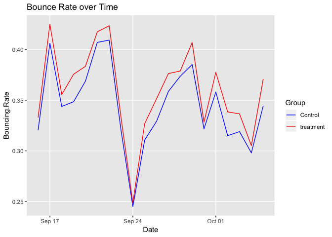
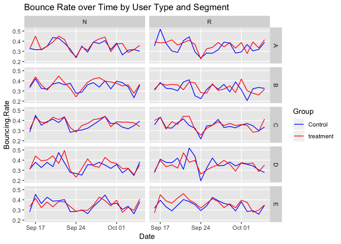

## A/B Testing Example

## This repository is a short example on A/B testing with fake data.

## Click [here](http://htmlpreview.github.io/?https://github.com/Georgemag121/AB_Testing/blob/master/AB_Test_Example.html) for a preview of the .html file


A/B Testing Results
================
Lingfeng George Yang
6/25/2019

Executive Summary
-----------------

Overall, the treatment does not perform better than the control in terms of Conversion Rate and Bounce Rate. On average, the treatment group has a 5.27% Conversion Rate while the control group has a 5.52% Conversion Rate, with an absolute difference of -0.26%. As for the Bounce Rate, on average, the treatment group has a 36.02% Bounce Rate while the control group has a 34.47% Bounce Rate, with an absolute difference of 1.55%. Overall, the treatment (treatment) group is -4.7% lower (aggregate relative difference) in Conversion Rate and 4.49% higher (aggregate relative difference) in Bounce Rate than the control group. The statistical tests demonstrate that the differences shown above are significant and that the treatment has a lower Conversion Rate and a higher Bounce Rate.

Moreover, none of the subgroups in this test shows a favorable result for the treatment over the control. Additional data on the categories of the Success (among other characteristics) could not only help explain the outlier date (Sep.24th) when the traffic volume was very high and the treatment performed better than the control, but also facilitate further analysis and future tests on sub-population groups. The results are displayed in the tables below.

#### Conversion Rate

<table style="width:67%;">
<colgroup>
<col width="11%" />
<col width="11%" />
<col width="11%" />
<col width="11%" />
<col width="11%" />
<col width="11%" />
</colgroup>
<thead>
<tr class="header">
<th align="left">Group</th>
<th align="right">Samples</th>
<th align="right">Total Success</th>
<th align="right">Conversion Rate</th>
<th align="right">Difference</th>
<th align="right">Aggregate Relative Difference</th>
</tr>
</thead>
<tbody>
<tr class="odd">
<td align="left">Control</td>
<td align="right">4,059,392</td>
<td align="right">224,276</td>
<td align="right">5.52%</td>
<td align="right"></td>
<td align="right"></td>
</tr>
<tr class="even">
<td align="left">treatment</td>
<td align="right">3,887,658</td>
<td align="right">204,688</td>
<td align="right">5.27%</td>
<td align="right">-0.26%</td>
<td align="right">-4.7%</td>
</tr>
</tbody>
</table>

#### Bounce Rate

<table style="width:67%;">
<colgroup>
<col width="11%" />
<col width="11%" />
<col width="11%" />
<col width="11%" />
<col width="11%" />
<col width="11%" />
</colgroup>
<thead>
<tr class="header">
<th align="left">Group</th>
<th align="right">Samples</th>
<th align="right">Total Bouncing</th>
<th align="right">Bounce Rate</th>
<th align="right">Difference</th>
<th align="right">Aggregate Relative Difference</th>
</tr>
</thead>
<tbody>
<tr class="odd">
<td align="left">Control</td>
<td align="right">4,059,392</td>
<td align="right">1,399,445</td>
<td align="right">34.47%</td>
<td align="right"></td>
<td align="right"></td>
</tr>
<tr class="even">
<td align="left">treatment</td>
<td align="right">3,887,658</td>
<td align="right">1,400,472</td>
<td align="right">36.02%</td>
<td align="right">1.55%</td>
<td align="right">4.49%</td>
</tr>
</tbody>
</table>

1. Background & Introduction
----------------------------

This report aims to investigate whether a treatment of a specfic web page improves user engagement over the current version. A test is conducted over a three week period (2018-09-16 - 2018-10-05) with (roughly) half the visitors receive treatment (treatment version) and the other half as control (old version). The main outcome variable is visitor count while segment, type, landing status, bouncing status, and success status are also controlled.

This report utilizes two metrics, Conversion Rate and Bounce Rate, to measure the success of the treatment over the control. The hypotheses are the control group has a lower Conversion Rate and a higher Bounce Rate (or simply, the treatment is better than the control), or mathematically as *μ*<sub>*c*1</sub> &lt; *μ*<sub>*c*2</sub> (where *μ*<sub>*c*1</sub> is the Conversion Rate of control and *μ*<sub>*c*2</sub> is the Conversion Rate of the treatment) and *μ*<sub>*b*1</sub> &gt; *μ*<sub>*b*2</sub> (where *μ*<sub>*b*1</sub> is the Bounce Rate of the control and *μ*<sub>*b*2</sub> is the Bounce Rate of the treatment). We will test these two hypotheses against their alternative hypotheses using a [z test](http://citeseerx.ist.psu.edu/viewdoc/download?doi=10.1.1.408.7107&rep=rep1&type=pdf). [1]

Lastly, this report also explores controlled variables and evaluates the risks and implications of this experiment, paving the way for future experiments and analyses.

------------------------------------------------------------------------

2. Data Preparation and Exploration
-----------------------------------

### 2-1) Import dataset

``` r
df.raw <- read.csv("data.csv", stringsAsFactors = F)
```

### 2-2) Inspect the raw dataset

#### (i) Structure

``` r
str(df.raw)
```

    ## 'data.frame':    1000 obs. of  8 variables:
    ##  $ Date     : chr  "9/16/18" "9/16/18" "9/16/18" "9/16/18" ...
    ##  $ Segment  : chr  "A" "A" "A" "A" ...
    ##  $ Type     : chr  "R" "R" "R" "R" ...
    ##  $ Landing  : int  0 1 1 0 1 0 1 1 0 1 ...
    ##  $ Bouncing : int  0 0 1 0 0 0 0 1 0 0 ...
    ##  $ Success  : int  0 0 0 1 1 0 0 0 1 1 ...
    ##  $ Control  : int  4008 14979 11561 524 1636 6518 27047 17923 616 2439 ...
    ##  $ Treatment: int  3691 13677 12507 333 1529 6012 23757 15699 672 2072 ...

#### (ii) Summary

``` r
summary(df.raw)
```

    ##      Date             Segment              Type              Landing   
    ##  Length:1000        Length:1000        Length:1000        Min.   :0.0  
    ##  Class :character   Class :character   Class :character   1st Qu.:0.0  
    ##  Mode  :character   Mode  :character   Mode  :character   Median :1.0  
    ##                                                           Mean   :0.6  
    ##                                                           3rd Qu.:1.0  
    ##                                                           Max.   :1.0  
    ##     Bouncing      Success       Control          Treatment      
    ##  Min.   :0.0   Min.   :0.0   Min.   :   53.0   Min.   :   40.0  
    ##  1st Qu.:0.0   1st Qu.:0.0   1st Qu.:  431.8   1st Qu.:  392.2  
    ##  Median :0.0   Median :0.0   Median : 1735.5   Median : 1674.5  
    ##  Mean   :0.2   Mean   :0.4   Mean   : 4059.4   Mean   : 3887.7  
    ##  3rd Qu.:0.0   3rd Qu.:1.0   3rd Qu.: 4559.2   3rd Qu.: 4410.0  
    ##  Max.   :1.0   Max.   :1.0   Max.   :31989.0   Max.   :29748.0

#### (iii) Missing Values

Observed:

``` r
sum(is.na(df.raw))
```

    ## [1] 0

Unobserved (Missing combinations not shown in the dataset):

``` r
# Unique values for each categorical variable
df.raw.dim <- sapply(sapply(df.raw[1:6], unique), length)
df.raw.dim
```

    ##     Date  Segment     Type  Landing Bouncing  Success 
    ##       20        5        2        2        2        2

``` r
# Check if all combinations of categorical variables are
# present: 20*5*2*2*2*2 != 1000
prod(df.raw.dim) == nrow(df.raw)
```

    ## [1] FALSE

``` r
# After quick visual inspection, I hypothesize that only 5
# unique combinations of Landing, Bouncing, and Success exist
# in this dataset (instead of 2*2*2 = 8). Check the
# hypothesis
df.raw %>% tidyr::unite(Landing, Bouncing, Success, col = "LBP.Comb") %>% 
    dplyr::select(LBP.Comb) %>% unique() %>% nrow()
```

    ## [1] 5

``` r
# Check again if the variable combinations match the number
# of rows in the dataset: 20*5*2*5 = 1000
prod(df.raw.dim[1:3], 5) == nrow(df.raw)
```

    ## [1] TRUE

### 2-3) Change data types and formats

Change date format to yyyy-mm-dd

``` r
df.raw$Date <- as.Date(df.raw$Date, format = "%m/%d/%y")
```

### 2-4) Melt the dataset

Stack Control and Treatment together into the same column by creating a new binary variable distinguishing the two groups. The raw dataset will be melted (gather function) and this transformation will faciliate the analysis on customer Conversion Rate and Bounce Rate by experiment groups. This process is demonstrated in this example:

**Before:**

| Date       | Segment | Type |  Landing|  Bouncing|  Success|  Control|  Treatment|
|:-----------|:--------|:-----|--------:|---------:|--------:|--------:|----------:|
| 2018-09-16 | A       | R    |        0|         0|        0|     4008|       3691|
| 2018-09-16 | A       | R    |        1|         0|        0|    14979|      13677|
| 2018-09-16 | A       | R    |        1|         1|        0|    11561|      12507|
| 2018-09-16 | A       | R    |        0|         0|        1|      524|        333|
| 2018-09-16 | A       | R    |        1|         0|        1|     1636|       1529|

**After:**

| Date       | Segment | Type |  Landing|  Bouncing|  Success| Group     |  Count|
|:-----------|:--------|:-----|--------:|---------:|--------:|:----------|------:|
| 2018-09-16 | A       | R    |        0|         0|        0| Control   |   4008|
| 2018-09-16 | A       | R    |        1|         0|        0| Control   |  14979|
| 2018-09-16 | A       | R    |        1|         1|        0| Control   |  11561|
| 2018-09-16 | A       | R    |        0|         0|        1| Control   |    524|
| 2018-09-16 | A       | R    |        1|         0|        1| Control   |   1636|
| 2018-09-16 | A       | R    |        0|         0|        0| Treatment |   3691|
| 2018-09-16 | A       | R    |        1|         0|        0| Treatment |  13677|
| 2018-09-16 | A       | R    |        1|         1|        0| Treatment |  12507|
| 2018-09-16 | A       | R    |        0|         0|        1| Treatment |    333|
| 2018-09-16 | A       | R    |        1|         0|        1| Treatment |   1529|

#### Melt df.raw

``` r
df1 <- df.raw %>% tidyr::gather(key = "Group", value = "Count", 
    Control, Treatment) %>% dplyr::arrange(Date, Segment, desc(Type), 
    Success, Bouncing, Landing)
```

### 2-5) Cast the dataset

Collapse Success and Bouncing columns seperately and create two datasets: df\_cr (for Conversion Rate) and df\_br (for Bounce Rate). The dataset will be cast using spread function.

#### (i) Conversion Rate

Create seperate visitor counts for Success and no Success:

``` r
df_cr <- df1 %>% # * Change values of Success column so the news values will
# be mapped to the column names of the new columns
dplyr::mutate(Success = if_else(Success == 1, "Success", "No.Success")) %>% 
    # * Collapse Success column
tidyr::spread(key = Success, value = "Count", fill = 0) %>% # * Create a new column for Conversion Rate (for each
# individual experiment condition)
dplyr::mutate(Conversion.Rate = round(Success/(Success + No.Success), 
    4)) %>% # * Arrange in acccordance to original format
dplyr::arrange(Date, Segment, desc(Type), Bouncing, Landing)
```

#### (ii) Bounce Rate

Create seperate visitor counts for Bouncing and no Bouncing:

``` r
df_br <- df1 %>% # * Change values of Bouncing column so the news values will
# be mapped to the column names of the new columns
dplyr::mutate(Bouncing = if_else(Bouncing == 1, "Bouncing", "No.Bouncing")) %>% 
    # * Collapse Bouncing column
tidyr::spread(key = Bouncing, value = "Count", fill = 0) %>% 
    # * Create a new column for Bounce Rate (for each individual
# experiment condition)
dplyr::mutate(Bouncing.Rate = round(Bouncing/(Bouncing + No.Bouncing), 
    4)) %>% # * Arrange in acccordance to original format
dplyr::arrange(Date, Segment, desc(Type), Success, Landing)
```

------------------------------------------------------------------------

3. Analysis
-----------

### 3-1) Overall Conversion Rate and Bounce Rate

``` r
df_cr_summ <- df_cr %>% dplyr::group_by(Group) %>% dplyr::summarise(Samples = sum(Success, 
    No.Success), Total.Success = sum(Success), Conversion.Rate = Total.Success/Samples) %>% 
    dplyr::mutate(Diff = c(NA, 0), Aggregate.Relative.Diff = c(NA, 
        0))

df_cr_summ$Diff[2] <- diff(df_cr_summ$Conversion.Rate)
df_cr_summ$Aggregate.Relative.Diff[2] <- df_cr_summ$Diff[2]/df_cr_summ$Conversion.Rate[1]

df_br_summ <- df_br %>% dplyr::group_by(Group) %>% dplyr::summarise(Samples = sum(Bouncing, 
    No.Bouncing), Total.Bouncing = sum(Bouncing), Bouncing.Rate = Total.Bouncing/Samples) %>% 
    dplyr::mutate(Diff = c(NA, 0), Aggregate.Relative.Diff = c(NA, 
        0))

df_br_summ$Diff[2] <- diff(df_br_summ$Bouncing.Rate)
df_br_summ$Aggregate.Relative.Diff[2] <- df_br_summ$Diff[2]/df_br_summ$Bouncing.Rate[1]
```

<table style="width:67%;">
<colgroup>
<col width="11%" />
<col width="11%" />
<col width="11%" />
<col width="11%" />
<col width="11%" />
<col width="11%" />
</colgroup>
<thead>
<tr class="header">
<th align="left">Group</th>
<th align="right">Samples</th>
<th align="right">Total Success</th>
<th align="right">Conversion Rate</th>
<th align="right">Difference</th>
<th align="right">Aggregate Relative Difference</th>
</tr>
</thead>
<tbody>
<tr class="odd">
<td align="left">Control</td>
<td align="right">4,059,392</td>
<td align="right">224,276</td>
<td align="right">5.52%</td>
<td align="right"></td>
<td align="right"></td>
</tr>
<tr class="even">
<td align="left">treatment</td>
<td align="right">3,887,658</td>
<td align="right">204,688</td>
<td align="right">5.27%</td>
<td align="right">-0.26%</td>
<td align="right">-4.7%</td>
</tr>
</tbody>
</table>

<table style="width:67%;">
<colgroup>
<col width="11%" />
<col width="11%" />
<col width="11%" />
<col width="11%" />
<col width="11%" />
<col width="11%" />
</colgroup>
<thead>
<tr class="header">
<th align="left">Group</th>
<th align="right">Samples</th>
<th align="right">Total Bouncing</th>
<th align="right">Bounce Rate</th>
<th align="right">Difference</th>
<th align="right">Aggregate Relative Difference</th>
</tr>
</thead>
<tbody>
<tr class="odd">
<td align="left">Control</td>
<td align="right">4,059,392</td>
<td align="right">1,399,445</td>
<td align="right">34.47%</td>
<td align="right"></td>
<td align="right"></td>
</tr>
<tr class="even">
<td align="left">treatment</td>
<td align="right">3,887,658</td>
<td align="right">1,400,472</td>
<td align="right">36.02%</td>
<td align="right">1.55%</td>
<td align="right">4.49%</td>
</tr>
</tbody>
</table>

#### Hypothesis testing

With the assumption that we can approximate the experiment with binomial distribution where each visit has a probability p of converting (or bouncing) and all visits are independent, we can test the hypotheses with the following z-tests. Given the large sample size and based on the Central Limit Theorem, we can approximate the binomial distribution with a normal distribution and z-tests are appropriate in this case.

``` r
prop.test(df_cr_summ$Total.Success, df_cr_summ$Samples, alternative = "greater", 
    correct = F)
```

    ## 
    ##  2-sample test for equality of proportions without continuity
    ##  correction
    ## 
    ## data:  df_cr_summ$Total.Success out of df_cr_summ$Samples
    ## X-squared = 262.47, df = 1, p-value < 0.00000000000000022
    ## alternative hypothesis: greater
    ## 95 percent confidence interval:
    ##  0.002334317 1.000000000
    ## sample estimates:
    ##     prop 1     prop 2 
    ## 0.05524867 0.05265072

``` r
prop.test(df_br_summ$Total.Bouncing, df_br_summ$Samples, alternative = "less", 
    correct = F)
```

    ## 
    ##  2-sample test for equality of proportions without continuity
    ##  correction
    ## 
    ## data:  df_br_summ$Total.Bouncing out of df_br_summ$Samples
    ## X-squared = 2088.9, df = 1, p-value < 0.00000000000000022
    ## alternative hypothesis: less
    ## 95 percent confidence interval:
    ##  -1.00000000 -0.01493525
    ## sample estimates:
    ##    prop 1    prop 2 
    ## 0.3447425 0.3602354

As demonstrated in the tables above, on average, the treatment group has a 5.27% Conversion Rate while the control group has a 5.52% Conversion Rate, with an absolute difference of -0.26%. As for the Bounce Rate, on average, the treatment group has a 36.02% Bounce Rate while the control group has a 34.47% Bounce Rate, with an absolute difference of 1.55%. Overall, the treatment (treatment) group is -4.7% lower (aggregate relative difference) in Conversion Rate and 4.49% higher (aggregate relative difference) in Bounce Rate than the control group. From the z tests, with p-values less than 0.00001 (or a level of confidence over 99.999%), we will reject the null hypotheses that the control has a lower Conversion Rate and a higher Bounce Rate and accept the alternative hypotheses that the control has a higher Conversion Rate and a lower Bounce Rate, or that the control performs better than the treatment.

### 3-2) Conversion Rate and Bounce Rate by day

``` r
df_cr_day <- df_cr %>% # * Add Date to grouping variable
dplyr::group_by(Date, Group) %>% dplyr::summarise(Samples = sum(Success, 
    No.Success), Total.Success = sum(Success), Conversion.Rate = Total.Success/Samples)

df_br_day <- df_br %>% # * Add Date to grouping variable
dplyr::group_by(Date, Group) %>% dplyr::summarise(Samples = sum(Bouncing, 
    No.Bouncing), Total.Bouncing = sum(Bouncing), Bouncing.Rate = Total.Bouncing/Samples)

df_cr_day %>% ggplot2::ggplot() + geom_line(aes(Date, Conversion.Rate, 
    color = Group)) + scale_x_date() + scale_color_manual(values = c(Control = "blue", 
    Treatment = "red"), labels = c("Control", "treatment")) + 
    guides(color = guide_legend(title = "Group")) + ggtitle("Conversion Rate over Time") + 
    theme1
```


``` r
df_br_day %>% ggplot2::ggplot() + geom_line(aes(Date, Bouncing.Rate, 
    color = Group)) + scale_x_date() + scale_color_manual(values = c(Control = "blue", 
    Treatment = "red"), labels = c("Control", "treatment")) + 
    guides(color = guide_legend(title = "Group")) + ggtitle("Bounce Rate over Time") + 
    theme1
```



Overall, we see that Conversion Rate is consistently lower for treatment (treatment) group than for control group and Bounce Rate is consistently higher for treatment group than for control group. However, there was an exception on Sep.24th when a much higher Conversion Rate and a much lower Bounce Rate were observed. Notably, the Conversion Rate of the treatment group was higher than that of the control group. This could be due to the irregular or abnormal traffic generated from a specific source. At any capacity, this irregularity is worthing probing and further analysis will be possible if there were more detailed sales information.

### 3-3) Conversion Rate and Bounce Rate by other variables

I have created the plot grid below to examine the Conversion Rate and Bounce Rate for subgroups. For any new features (that potentially improves the interface), returning users may not respond as positively as newcomers simply because the old customers already got used to the current layout. Also, traffic directed from different sources could also play a part in how the users might interact with the treatment.

#### Conversion Rate

``` r
df_cr_other <- df_cr %>% dplyr::group_by(Segment, Type, Date, 
    Group) %>% dplyr::summarise(Samples = sum(Success, No.Success), 
    Total.Success = sum(Success), Conversion.Rate = Total.Success/Samples)

df_cr_other %>% ggplot2::ggplot() + geom_line(aes(Date, Conversion.Rate, 
    color = factor(Group))) + scale_x_date() + scale_color_manual(values = c(Control = "blue", 
    Treatment = "red"), labels = c("Control", "treatment")) + 
    guides(color = guide_legend(title = "Group")) + ggtitle("Conversion Rate over Time by User Type and Segment") + 
    facet_grid(Segment ~ Type, labeller = label_wrap_gen(10)) + 
    theme1
```


#### Bounce Rate

``` r
df_br_other <- df_br %>% dplyr::group_by(Segment, Type, Date, 
    Group) %>% dplyr::summarise(Samples = sum(Bouncing, No.Bouncing), 
    Total.Bouncing = sum(Bouncing), Bouncing.Rate = Total.Bouncing/Samples)

df_br_other %>% ggplot2::ggplot() + geom_line(aes(Date, Bouncing.Rate, 
    color = factor(Group))) + scale_x_date() + scale_color_manual(values = c(Control = "blue", 
    Treatment = "red"), labels = c("Control", "treatment")) + 
    guides(color = guide_legend(title = "Group")) + ggtitle("Bounce Rate over Time by User Type and Segment") + 
    facet_grid(Segment ~ Type, labeller = label_wrap_gen(10)) + 
    theme1
```



There were no highly noticeable trends (apart from the ones observed from the time series plots) from the subgroups and the treatment performs consisently worse than the control.

4. Conclusions
--------------

Based on the data collected in 20 days, I would revert to control and not deploy the treatment based on two main metrics: Conversion Rate and Bounce Rate. Specifically, we have observed that the average Conversion Rate is 4.70% lower and the Bounce Rate is 4.49% higher (aggregate relative difference) for the treatment for almost all sub-population groups throughout the testing period.

With that said, there are three potential risks in choosing the control over the treatment. First and foremost, Sep.24th appears to be an outlier and there was a reversal where the treatment performed better with unusually high number of visitors. If there were data available on the category or characteristics of the traffic on that day, we could better understand and further test out if certain sub-groups might react positively towards the change. Also, the two metrics used here might not be reflective of revenue. It is possible that the treatment does much better than the control on the higher valued sales and much worse on the lower valued ones. As a result, both Conversion Rate and Bounce Rate may suggest that the control group does better, but the treatment might generate higher revenue overall. Although highly unlikely, this scenario needs to be looked at and eliminated with the help of pricing data. Lastly, the assumptions that all visits are independent might not hold given that same visitors could have counted for multiple visits and across groups (New user becoming returning user in subsequent visits). However, given the large sample size and extremely low p-value, I would not worry too much about it.

Overall, athough there could be certain sub-groups of the visits where the treatment could perform better (which requires further testing with the help of the more detailed category data of the sales), given the overwhelming results from the statistical tests, I would suggest with an extremely high level of confidence (&gt; 0.99999) that we revert to the control even without the corroboration from other datasets.

------------------------------------------------------------------------

[1] Newcombe R.G. (1998) Two-Sided Confidence Intervals for the Single Proportion: Comparison of Seven Methods. Statistics in Medicine 17, 857–872.
